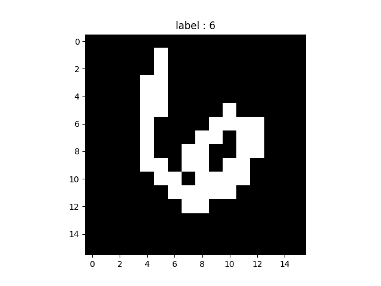

# 1. Dataset Usage
### ★ Installation

```bash
pip install torch torchvision matplotlib pillow PyYAML scipy
```

### ★ How to Load the Dataset

Refer to the example code in `example_load_data.py` for details on how to load and use the dataset.
The loaded dataset provides pairs of:
- Digit image (resized)
  - Default size: 16×16
  - You can change the image size in config.yaml
  - Image is halftoned — pixel values are either 0 or 1
- Label
  - Integer from 0 to 9

**Sample Image**




# 2. Randomness evaluation

Use these metrics to assess whether a noise image is truly random.

Refer to the example code in `example_evaluate_randomness.py` for details on how to analyze randomness.

**Practical Notes**
- Combine multiple metrics: a single failure does not conclusively prove non-randomness.
- For very small images (≤ 16×16), repeat tests on many independent samples and average results.
- Use dynamic calibration (mean + 3σ) for the FFT metric to adapt to your image resolution and scaling.
- Treat thresholds as heuristic indicators, not strict pass/fail boundaries.

### 1) Chi-Square Goodness-of-Fit Test
<span style="color: Green;">**Are pixel intensities (0–255) uniformly distributed?**</span> 
1. Count occurrences $O_i$ for each gray level $i \in \{0,\ldots,255\}$.
2. Expected counts $E_i = N / 256$, where $N = 256$ pixels.
3. $\chi^2 = \sum_i (O_i - E_i)^2 / E_i$; compare to $\chi^2$ distribution with 255 df to get p-value.

**Interpretation:**
- Large $\chi^2$ (small p) → deviates from uniformity (non-random generator or biased range).
- Reasonable $\chi^2$ (non-small p) → consistent with uniformity.

**Pitfalls:**
- Sparse counts ($E_i \approx 1$) reduce test reliability; aggregate bins or evaluate multiple images.

### 2) Adjacent-Pixel Correlation
<span style="color: Green;">**Are neighboring pixels uncorrelated?**</span> 
- Compute Pearson correlation between horizontally adjacent pairs and vertically adjacent pairs:
  $\text{corr}_h = \text{corr}(X[:, :-1], X[:, 1:])$; $\text{corr}_v = \text{corr}(X[:-1, :], X[1:, :])$
- Optionally include diagonals.

**Interpretation:**
- Values near 0 → consistent with independence.
- Positive corr → clustering/smoothing; negative corr → checkerboard-like alternation.

**Pitfalls:**
- Small sample size; report confidence intervals or test multiple images.

### 3) FFT Spectral Flatness
<span style="color: Green;">**Is there any periodic structure (non-white spectrum)?**</span> 
1. Compute 2D FFT magnitude $|F(u,v)|$.
2. Assess flatness: e.g., variance of $|F|$ over frequencies, or spectral flatness measure (geometric/arith mean).

**Interpretation:**
- Flat (low-variance) spectrum → white-like noise.
- Peaks/anisotropy → periodic patterns, banding, or artifacts.

**Pitfalls:**
- DC component dominates; exclude or normalize. Windowing and mean-centering help.

### 4) Moran's I
<span style="color: Green;">**Is there global spatial dependence across the grid?**</span> 
  $$I = \frac{N}{\sum_{ij} w_{ij}} \cdot \frac{\sum_{ij} w_{ij} (x_i - \bar{x})(x_j - \bar{x})}{\sum_i (x_i - \bar{x})^2}$$
  where $w_{ij}$ are spatial weights (e.g., 4-nearest neighbors), $N=256$.

**Interpretation:**
- $I > 0$ → clustering/smoothing (non-random).
- $I < 0$ → checkerboard-like alternation (non-random).
- $I \approx 0$ → consistent with spatial randomness.

**Pitfalls:**
- Choice of neighborhood (4- or 8-neighbors) affects magnitude; report your W.

### 5) Runs Test (after Binarization)
<span style="color: Green;">**Do black/white sequences behave like a random Bernoulli process?**</span> 
1. Binarize image (e.g., threshold at 128): sequence $s \in \{0,1\}$ of length 256 (row-major).
2. Count number of runs $R$ (maximal consecutive equal bits).
3. Use Wald–Wolfowitz runs test with counts $n_0$, $n_1$ to obtain expected $E[R]$ and variance $\text{Var}[R]$, then z-score.

**Interpretation:**
- Too few runs → excessive clustering (non-random).
- Too many runs → over-alternation (non-random).
- $z$ near 0 → consistent with randomness.

**Pitfalls:**
- Threshold choice matters; test multiple thresholds or bit-planes to reduce bias.


